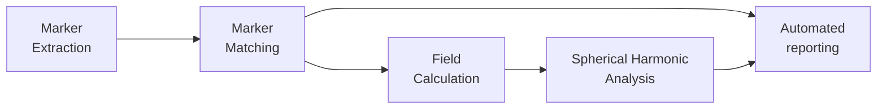

# MRI_DistortionQA  
    

**Authors:** Brendan Whelan, Paul Liu, Shanshan Shan

This code enables characterization and reporting of geometric distortion in Magnetic Resonance Imaging. For the measurement of such distortions, see [here](https://github.com/ACRF-Image-X-Institute/MRI_DistortionPhantom). The basic end-to-end workflow is below, but all steps have well defined input/output so you can use any part of this code independently from the other parts. For a tutorial on each step, click on the diagram below. For an example of our automated reporting template see [here](https://acrf-image-x-institute.github.io/MRI_DistortionQA/_static/MR_QA_report_20_05_2022.html)



## Setup/Build/Install

```bash
pip install MRI_DistortionQA
```


## Usage

Detailed documentation is [here](https://acrf-image-x-institute.github.io/MRI_DistortionQA/).

## Directory Structure

- *docsrc* markdown/rst source documentation
- *tests* test cases
- *MRI_DistortionQA* source code
- *examples* source code for the [worked examples](https://acrf-image-x-institute.github.io/MRI_DistortionQA/examples.html)
