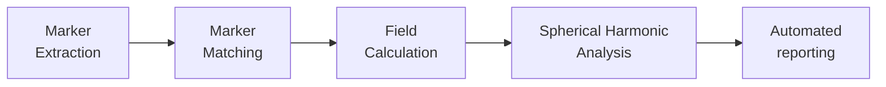

# MRI_DistortionQA  
 

**Authors:** Brendan Whelan, Paul Liu, Shanshan Shan

This code enables characterization and reporting of geometric distortion in Magnetic Resonance Imaging. The basic end-to-end workflow is below, but all steps have well defined input/output so you can use any part of this code independently from the other parts. For a tutorial on each step, click on the diagram below.





## Setup/Build/Install

```bash
pip install MRI_DistortionQA  # soon!!
```


## Usage

Detailed documentation is AT SPHINX DOCS

## Directory Structure

- *docs* contains html documentation
- *docsrc* markdown/rst source documentation
- *tests* test cases
- *MRI_DistortionQA* source code
