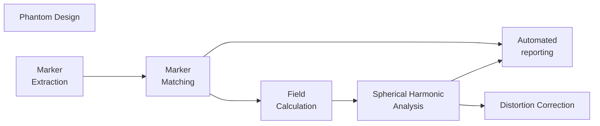

# mri_distortion_toolkit  
[](https://codecov.io/gh/ACRF-Image-X-Institute/mri_distortion_toolkit)    [](https://badge.fury.io/py/mri_distortion_toolkit)

This code enables characterization, reporting, and correction of geometric distortion in Magnetic Resonance Imaging.

The workflow steps are below. All steps have well defined input/output so you can use any part of this code independently from the other parts. For an example of our automated reporting template see [here](https://acrf-image-x-institute.github.io/mri_distortion_toolkit/_static/MR_QA_report_20_05_2022.html)




## Setup/Build/Install

```bash
pip install mri_distortion_toolkit
```

## Usage

Detailed documentation is [here](https://acrf-image-x-institute.github.io/mri_distortion_toolkit/). 

## Directory Structure

- *docsrc* markdown/rst source documentation
- *tests* test cases
- *mri_distortion_toolkit* source code 
- *examples* source code for the [worked examples](https://acrf-image-x-institute.github.io/mri_distortion_toolkit/examples.html)
