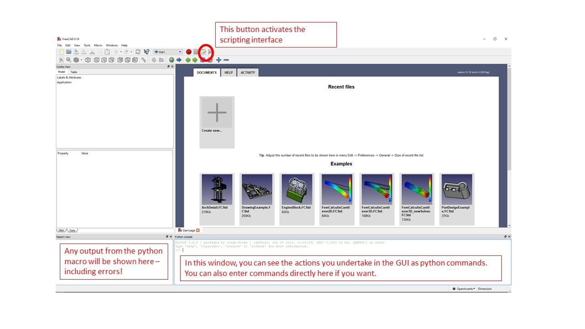

# Getting Started

## Setting up FreeCAD

FreeCAD of course has its [own documentation](https://wiki.freecad.org/Getting_started), which should be your first point of call for any trouble shooting of this program. Here, we provide a basic intro into setting up and configuring freeCAD so that you can build your first phantom. 

1. [Download FreeCAD](https://www.freecadweb.org/downloads.php). This code was developed and tested with version 0.19. Future versions should work, but if you run into issues go with version 0.19
2. Open FreeCAD 
3. In “View” “panels” enable both the python console and the report view. This isn't required, but in my opinion tends to make life easier!
4. After these steps, you should have something that looks like the image below, and are ready to generate your first phantom!

## Generating your first phantom design

Please see [here]() for some example scripts.

