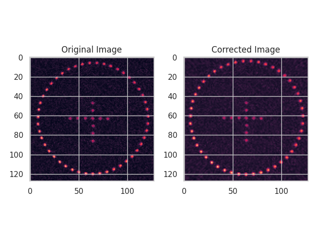
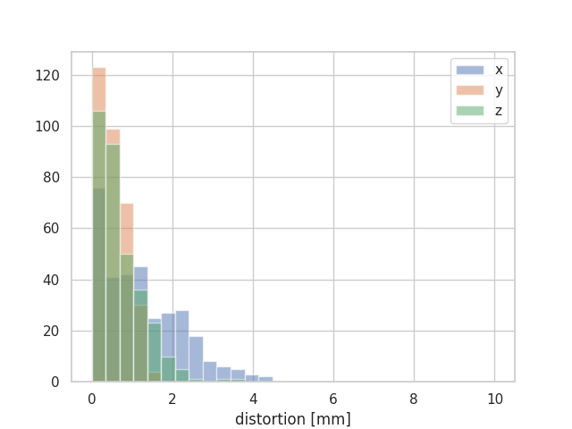
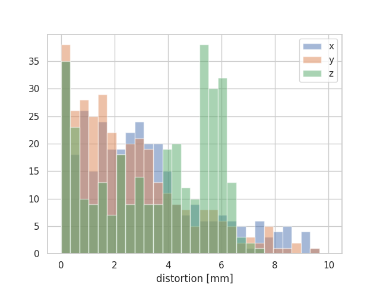
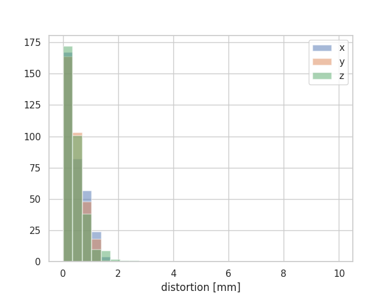

# Distortion Correction

Once we have a knowledge of the distorting fields, we should be able to use this knowledge to correct distorted images. With the spherical harmonics, we have all the knowledge of the fields we need. 

There are two main approaches to correcting gradient distortion: Image domain and k-space domain. Both methods are implemented in this code. The following code snippet demonstrates correction in the image domain. You should use the harmonics calculated and saved in the previous examples, or you can use the ones stored [here](https://github.com/ACRF-Image-X-Institute/mri_distortion_toolkit).

```python
from mri_distortion_toolkit.DistortionCorrection import ImageDomainDistortionCorrector
from mri_distortion_toolkit.MarkerAnalysis import MarkerVolume, MatchedMarkerVolumes
from mri_distortion_toolkit.utilities import plot_distortion_xyz_hist
from pathlib import Path
import numpy as np

'''
download example data and unzip:
https://cloudstor.aarnet.edu.au/plus/s/Wm9vndV47u941JU
'''
distorted_data_loc = Path(r'/home/brendan/Downloads/MRI_distortion_QA_sample_data/MR/04 gre_trans_AP_330')

GDC = ImageDomainDistortionCorrector(ImageDirectory=distorted_data_loc.resolve(),
                                     gradient_harmonics=[Path('_example_data/G_x_Harmonics.csv').resolve(),
                                                         Path('_example_data/G_y_Harmonics.csv').resolve(),
                                                         Path('_example_data/G_z_Harmonics.csv').resolve()],
                                     ImExtension='dcm'
                                     correct_through_plane=False)

GDC.correct_all_images()
GDC.save_all_images()  # saves as png so you can quickly inspect results
GDC.save_all_images_as_dicom()  # saves as dicom which can be read into analysis packages.
```

To switch from image domain to k-space domain, you just need to change two lines of code:

```python
from mri_distortion_toolkit.DistortionCorrection import ImageDomainDistortionCorrector
# to
from mri_distortion_toolkit.DistortionCorrection import KspaceDistortionCorrector
#and
GDC = ImageDomainDistortionCorrector(...
# to
GDC = KspaceDistortionCorrector(...
```

In principle the k-space corrector should perform better than the image domain corrector in terms of blurring in the corrected image, however it is substantially slower. Also, the k-space code is around fives times slower on linux than on windows for reasons we are still trying to figure out! 

Following correction, you may wish to test how well the correction actually worked.

The `GDC.save_all_images()` line will have saved all images in a folder called corrected the `ImageDirectory`. You can visually examine these for a comparison for the pre/post distortion:





Although somewhat useful to check the the correction hasn't made things look much worse, it's not very quantitative. For that, you can read the corrected dicom images back into a MarkerVolume, and quantify the distortion in that:

```python
this_file_loc = Path(__file__).parent.resolve()
gt_data_loc = Path(r'/home/brendan/Downloads/MRI_distortion_QA_sample_data/CT/slicer_centroids.mrk.json'
gt_volume = MarkerVolume(gt_data_loc)

corrected_volume = MarkerVolume(distorted_data_loc / 'corrected_dcm',
                                n_markers_expected=336,
                                iterative_segmentation=True, r_max=160)
remove_ind = np.logical_and(corrected_volume.MarkerCentroids.r >= 70, corrected_volume.MarkerCentroids.r <= 140)
corrected_volume.MarkerCentroids = corrected_volume.MarkerCentroids.drop(
    corrected_volume.MarkerCentroids.index[remove_ind])
matched_volume_corrected = MatchedMarkerVolumes(gt_volume, corrected_volume, n_refernce_markers=11)
plot_distortion_xyz_hist(matched_volume_corrected)
```

This generates the following histogram:




Compare this with the uncorrected version, and it is clear that this distortion correction has been quite effective:



## But why isn't the distortion correction better?!

Although the distortion correction markers are far superior to the uncorrected version, they still aren't THAT good, with maximum distortions up to ~5 mm which is quite a lot.

The main reason for this is that we are not correcting B0; you can see that the biggest residual distortions are in the x direction, which is the frequency encode direction, and the next biggest are in z, which is the slice encoding direction. How good might the results look if we could correct B0 as well?

This is currently under development, but as a sneak preview, here are the results which incorporate B0 correction as well:


