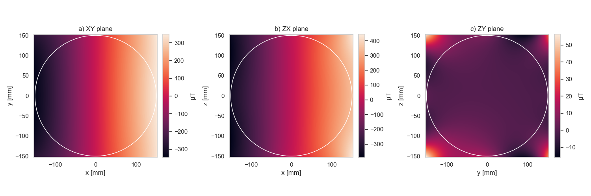

# Spherical Harmonics

Spherical harmonics can be used to characterise any magnetic field in a source free region. Practically, this means that if you can fit spherical harmonics to a limited number of data points, you can reconstruct the underlying magnetic field anywhere. This is particualrly useful for distortion correction algorithsm, but as we will see later can also be used to to generate data rich reports.
A basic code to calculate spherical harmonics from the field data we have just calculated is below:

```python
from MRI_DistortionQA.MarkerAnalysis import MarkerVolume
from MRI_DistortionQA import calculate_harmonics
from pathlib import Path
import pandas as pd
from MRI_DistortionQA.utilities import get_dicom_data


FieldData = pd.read_csv('_example_data/Bfields.csv', index_col=0).squeeze("columns")
dicom_data_loc = Path('_example_data') / 'MR' / '04 gre_trans_AP_330' / 'dicom_data.json'  # previosly saved from a MarkerVolume
dicom_data = get_dicom_data(dicom_data_loc)
gradient_strength = np.array(dicom_data['gradient_strength']) * 1e3
normalisation_factor = [1/gradient_strength[0], 1/gradient_strength[1], 1/gradient_strength[2], 1]  # this normalised gradient harmonics to 1mT/m

G_x_Harmonics, G_y_Harmonics, G_z_Harmonics, B0_Harmonics = calculate_harmonics(FieldData, norm=normalisation_factor, n_order=8)
# note that B0_harmonics is None as we did not provide distorted_volume_rev to calculate_harmonics
G_x_Harmonics.harmonics.to_csv(data_loc / 'G_x_Harmonics.csv')
G_y_Harmonics.harmonics.to_csv(data_loc / 'G_y_Harmonics.csv')
G_z_Harmonics.harmonics.to_csv(data_loc / 'G_z_Harmonics.csv')
```

## some plotting examples

Each instance of spherical harmonic fit has some handly plotting function you can use to quickly visualise the fields and harmonics: examples below.

```python
G_x_Harmonics.plot_cut_planes()
G_x_Harmonics.plot_harmonics_pk_pk(cut_off=.01)
G_x_Harmonics.print_key_harmonics(cut_off=.01)
```



**Reconstructed fields in each cardinal plane for the X gradient coil. Note that there is strong variantion in X (as expected) and the field is close to 0 in the ZY plane (as expected)**


**This figure shows the dominant harmonics for the X gradient. If you are a harmonics nerd, you will know that the A11 harmonic corresponds to a perfect X gradient field; therefore it is gratifying to see that this is by far the most strongly expressed harmonic for the X gradient!**

## Explaining the code output:

The code probably printed the following to the screen:

```
[FieldAnalysis.py: line 86  WARNING] input sample points do not appear to cover a full sphere
Initial pk-pk:        693.401 μT
Reconstructed pk-pk:  693.795 μT
Residual pk-pk:       2.023 μT
```

The warning here is telling us that the sample points do not appear to cover a full sphere. We can ignore this in situations where we are confident that we have sufficient sampling of points for the order of harmonics we are fitting. 

- [ ] ToDo: automate this check!!

The second part is telling us the peak-to-peak perturbation over the surface of r_outer (150 mm in this case). We would like to see that the reconstructed pk-pk closely matches the input, and that the residual pk-pk is low relative to the total. In this case, the reconstructed pk-pk is within 0.4 μT and the residual is < 1%, so the fit is pretty good!

## Next steps

You are ready to move onto [Reporting](https://acrf-image-x-institute.github.io/MRI_DistortionQA/reporting.html)!
