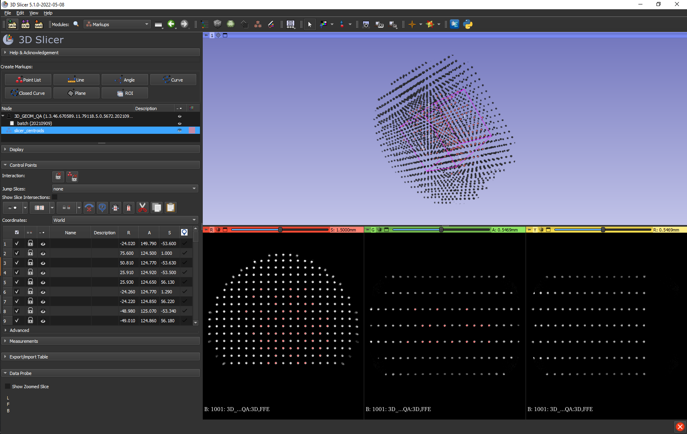

# Marker Extraction

## Basic examples

Say that you have [built](https://acrf-image-x-institute.github.io/MRI_DistortionPhantom/phantom_construction.html) and [imaged](https://acrf-image-x-institute.github.io/MRI_DistortionPhantom/phantom_imaging.html) a marker-based distortion phantom. To use this data within this library, you first have to extract the position of the markers and create a 'MarkerVolume'. This example shows you how do that.


> :warning: For this part you will need some data. **Example data is provided [here](https://cloudstor.aarnet.edu.au/plus/s/Wm9vndV47u941JU)**. Download and unzip this data somewhere and take note of the path. The source code this example is based on is [here](https://github.com/ACRF-Image-X-Institute/MRI_DistortionQA/tree/main/examples).

First, create a directory called 'MRI_QA_tutorial' or something like that. Within that directory, create a new python file called 'MarkerExtractionExample'. Copy the below code into it, and update

```python
from MRI_DistortionQA.MarkerAnalysis import MarkerVolume
from pathlib import Path
import numpy as np
import pandas as pd

'''
download example data and unzip:
https://cloudstor.aarnet.edu.au/plus/s/Wm9vndV47u941JU
'''

data_loc = Path('/home/brendan/Downloads/MRI_distortion_QA_sample_data')
gt_data_loc = data_loc / 'CT'
# ^^ update to where you put the sample data!!
gt_volume = MarkerVolume(gt_data_loc, r_max=300)
gt_volume.plot_3D_markers()  # produce a quick plot of marker positions
```

There are various code options that can help extract markers for more difficult data; you can read about them [here](https://acrf-image-x-institute.github.io/MRI_DistortionQA/code_docs.html#module-MRI_DistortionQA.MarkerAnalysis). If you want to get at the segmented data, it is stored in ```marker_volume.MarkerCentroids``` as a pandas dataframe. 

For large datasets, it can be quite time consuming to read in and process the data. Therefore, we provide a means to save the data so you can quickly read it back in later:

```python
marker_volume.export_to_slicer()  
```

This will save a file called *slicer_centroids.mrk.json* at gt_data_loc. As the name implies, you can also import this file into [Slicer](https://www.slicer.org/) If you want you can specify a different location and filename instead:

```
marker_volume.export_to_slicer(save_path='path\to\save', filename='slicer_centroids'):
```

To read the resultant mrk.json file back in, you simply have to pass it as the main argument:

```
gt_volume_from_json = MarkerVolume(gt_data_loc / 'slicer_centroids.mrk.json')
```

If you wanted to continue to create volume for MR data, the process is very similar:

```python
mr_data_loc = data_loc / 'MR' / '04 gre_trans_AP_330'
mr_data_loc_reverse_gradient = data_loc / 'MR' / '05 gre_trans_PA_330'
mr_volume = MarkerVolume(mr_data_loc, correct_fat_water_shift=True, fat_shift_direction=-1)
```

Note that we are correcting fat water shift here; you can read more about that [here](https://acrf-image-x-institute.github.io/MRI_DistortionPhantom/phantom_imaging.html)

You can also create a MarkerVolume from a pandas data frame:

```python
# pandas data frame read in
r_outer = 150
test_data = np.random.rand(100, 3) * r_outer  # create some random data
test_data = pd.DataFrame(test_data, columns=['x', 'y', 'z'])  # convert to data frame
pandas_volume = MarkerVolume(test_data)  # create MarkerVolume
```

This allows you to use the rest of the code even if you are working with a different distortion phantom - all you need is a set of ground truth control points and distorted control points.

 At this point, you are free to move on to the next step: [automatic matching of markers](https://acrf-image-x-institute.github.io/MRI_DistortionQA/marker_matching.html), or you can read on about some more advanced features below...

## Comparing MarkerVolumes

It is a common situation to have two marker volumes and want to compare what they look like. We provide [a few plotting methods](https://acrf-image-x-institute.github.io/MRI_DistortionQA/code_docs.html#MRI_DistortionQA.utilities.plot_MarkerVolume_overlay) to do this:

```
from MRI_DistortionQA.utilities import plot_MarkerVolume_overlay
from MRI_DistortionQA.utilities import plot_compressed_MarkerVolumes

plot_MarkerVolume_overlay([mr_volume, mr_volume_rev])
plot_compressed_MarkerVolumes([mr_volume, mr_volume_rev])
```

## Do we guarantee that we will find your markers?

Short answer: No! 

Although the automatic extraction works quite well in most cases, because there are so many variables in MR, we have no knowledge of the signal-to-noise, contrast-to-noise, contrast type, voxel size, etc. that you may be using. This means that it is very difficult to automatically know what settings to use for marker extraction. In some low SNR cases, no matter what settings you use automatic extraction is difficult, but in most cases you should be able to find a reliable combination of settings for a given scan and scanner.

## Is that a major issue?

Also no!

We provide an easy interface to [slicer](https://www.slicer.org/) via the ```export_to_slicer``` method; we also read these slicer .json files back in as demonstrated in the example above. This means that in situations where the automatic marker processing fails, you are free to move, delete and add markers through the excellent slicer GUI. Once you are satisfied, you can go file>>save data and save the *.mrk.json file for reading back into this workflow. A screenshot of the process of editing marker locations in slicer is below:



## Handling Fat-water shift 

If you are using a phantom with oil filled markers, your images may be subject to [fat-water shift](https://acrf-image-x-institute.github.io/MRI_DistortionPhantom/phantom_imaging.html#fat-water-chemical-shift).

The best way to check this is to take a forward/reverse gradient pair of images, and compare the markers in the middle of the DSV. Since B0 homogeneity is very good here, if the markers are offset from each other it is due to fat/water shift.

You can read about the different options for handling this effect [here](https://acrf-image-x-institute.github.io/MRI_DistortionPhantom/phantom_imaging.html#fat-water-chemical-shift); but one option is to correct for this in software. If you want to do that, the code would look this:

```python
from MRI_DistortionQA.MarkerAnalysis import MarkerVolume
from pathlib import Path
from MRI_DistortionQA.utilities import plot_MarkerVolume_overlay

marker_volume_forward = MarkerVolume(data_loc / 'MR' / '04 gre_trans_AP_330', verbose=False,
                             correct_fat_water_shift=True, fat_shift_direction=-1)
marker_volume_back = MarkerVolume(data_loc / 'MR' / '05 gre_trans_PA_330', verbose=False,
                             correct_fat_water_shift=True, fat_shift_direction=1)
plot_MarkerVolume_overlay([marker_volume_forward, marker_volume_back])
```

- This will apply a shift to the marker positions based on the estimate of fat/water chemical shift
- We know which axis the shift will occur in (the frequency encode direction) but we are not yet confident we can predict the direction (forward/back). ```fat_shift_direction``` controls this. Basically you need to compare the markers in the center of the phantom for the forward/ reverse gradient images. If it worked, you should see that markers in the center of the phantom are closely aligned. If it moved them further apart, change the sign. If they still aren't, then log an issue!
- If you use this feature, please let us know because as you can tell it is still under development a bit!


