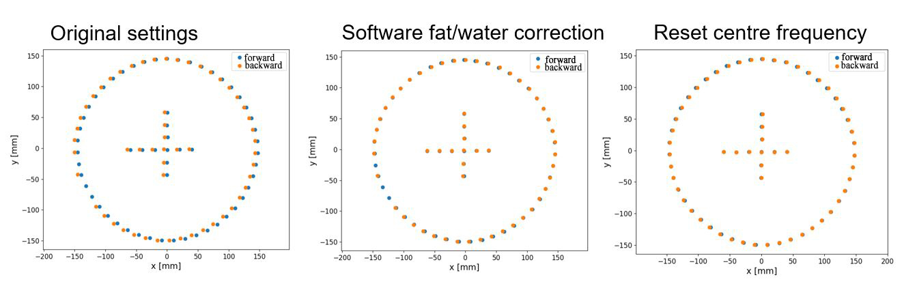
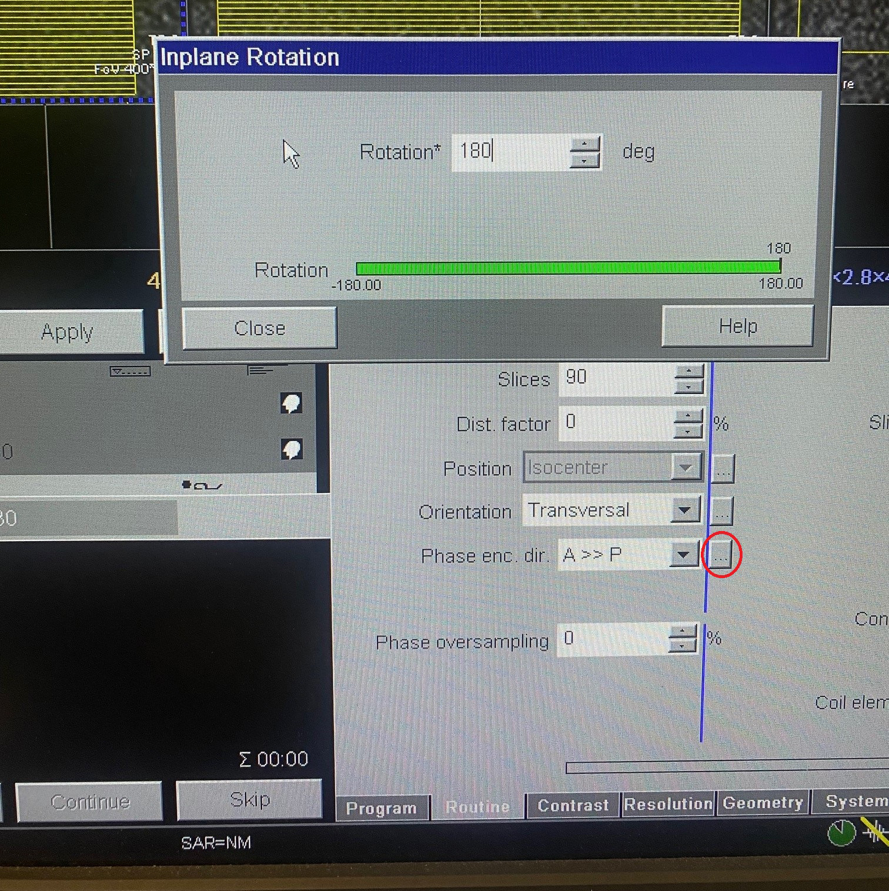

# Phantom Imaging

Below are some things to think about when imaging the phantom. \

All our development work has been on a siemens scanner running VB 19A. Therefore, although the principles outlined below are scanner independent, the specific instructions are siemens specific. If you can update these instructions for other vendors, please do so! 


## Fat-Water chemical shift
If you use oil capsules as the markers in your phantom, there is an important effect you must be aware of: [Fat-Water chemical shift](https://mriquestions.com/f-w-chemical-shift.html). This means if your scanner has a center frequency calibrated for water (which it almost certainly does), the oil based capsules will be offset in the readout direction. There are a number of things you can do to avoid this:

1. **Set the scanner center frequency to oil instead of wate**r. Most scanners should have some method to reset the central frequency based on a given load. Specific instructions are scanner specific; an example from our siemens scanner is shown below.  The phantom itself may not provide sufficient load to carry out this procedure; in this case you could simply use a bottle of oil. If you successfully reset the central frequency, you will remove any offsets due to fat-water shift. The central frequency is encoded in the dicom header, so you can always retrospectively check what was used.
2. **Use a large bandwidth**: Since fundamentally this is a B0 distortion, the same mitigation used for B0 can be used. If you use a large enough bandwidth, the fat-water shift will be almost eliminated. However, this will also result in a drop in SNR, so the tradeoff must be made carefully. 
3. **Correct in software**: the fat-water shift is a known effect; its magnitude at a given field strength can easily be calculated. Therefore, it is in possible to [correct for it in software]([https://acrf-image-x-institute.github.io/MRI_DistortionQA/code_docs.html#module-MRI_DistortionQA.MarkerAnalysis](https://acrf-image-x-institute.github.io/mri_distortion_toolkit/marker_extraction.html#handling-fat-water-shift)).
4. **Use water based markers:** In many ways this is the ideal solution, except for one thing: we haven't been able to find any water based markers yet!

In general, the best way to check whether you have removed the fat-water shift is to compare markers near the **center** of a phantom that were taken with a forward/reverse read out gradient (instructions for a siemens scanner below). Since B0 homogeneity should be good at the center of the phantom, if the central markers are not well aligned then it is because fat-water shift.


**Figure: for a siemens scanner, the center frequency can be reset for a given load by going options>>adjustments then clicking go until the measurement converges (may take a few tries). Then click apply to apply the new frequency.**


**Figure: In the original image, no fat water correction has been made. As a result, the markers in the center of the image are offset from each other in the frequency direction. In the second image, this effect has been corrected for in software. In the third image, this effect has been corrected for by adjust the center frequency of the scanner.**

## Separation of B0/ Gradient distortion effects

There are two 'system based' sources of distortion in MRI: the gradient coils, and B0 inhomogeneity (there are also patient specific effects, which we ignore here.)

- Gradient distortion appears in every direction, and is essentially independent of imaging sequence.
- For standard sequences, B0 distortion appears only in the **readout** (frequency encode) direction, and is [highly sequence dependent](https://pubmed.ncbi.nlm.nih.gov/19810464/) . 

For a given sequence, these effects can be separated as follows: 

1. Take the first phantom image
2. Reverse the phase encoding direction. See image below for example in a siemens scanner.
3. The gradient distortion is the same in both images, while the direction of B0 distortion is reversed. Therefore, the gradient distortion is the average position of each marker between the two images.

To put this into a very simple example: consider just one marker and one dimension. This marker has a ground truth position (for instance measured with CT) of x_gt; gradient non-linearity causes it instead to appear at x_gnl. If we take two scans with opposite encoding directions x_forward and x_backward, we observe this marker at x_scan1 and x_scan2. We can separate the gradient and B0 effects as follows:
```
x_gnl = mean(x_scan1, x_scan2) = (x_scan1, x_scan2)/2
x_b0 = x_gt - x_gnl
```
At this point, we have a good estimate of the perturbation caused by gradient non-linearity in x which will be sequence independent, and a good estimate of the perturbation caused by B0, which will be sequence dependent. We would then have to repeat this process for encoding directions y and z to get a good estimate of each gradient field.

If this all makes your head hurt as much as it does mine, you have two options:

1. If you don't care about B0 (e.g. you are sure it is small enough that you don't need to worry about it), then use a large imaging bandwidth in conjunction with a spin echo sequence. Both of these will minimize your sensitivity to B0 inhomogeneity such that you can ignore B0 effects.
2. We have provide analysis software (**coming soon**!) ADD LINK that automates these steps for you. 


**Figure: this is the screen where you can reverse the phase encoding direction in the Siemens software. In the siemens software, reversing the phase encoding direction also reverses the read out (frequency) direction.**


